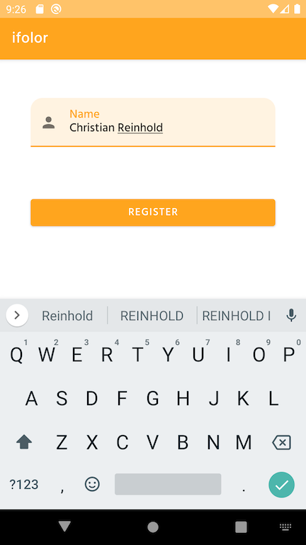

# ifolor
Registration screens for the ifolor app.

## Architecture

The main concern was to split the code so that you can have a clear separation of ui, business logic and io. 

Since there is no requirements of caching nor requesting data via Internet, the only important layer in the io level is the data module to persist the user information.

Since we believe in architecting only what is necessary, the final separation was:

- **Core:** Small package for dependency injection, utility extensions and login capabilities.
- **Data:** Persistence of the data entity into a room database.
- **Domain:** Business specific models like validators.
- **UiCore:** All ui related stuff that is not part of a feature, e.g., custom views, actions, data binding, etc.
- **UiFeatures:** All ui related stuff that is part of feature and not shared to others. Normally here you fill find, for example, the activities and the viewmodels.

## The MVVM approach
The viewmodel is in charge of observing databinding events coming from the user and reacting on it. If the user clicks on an item. the viewmodel will be notifide via the layout binding features and react on it. 

Sometimes it will just need to emit viewmodel actions to the activity to show a date picker dialog or navigate to another screen. 

In other situations it will need to communicate with the data layer to persist the data for example.

In both situations we are using coroutines (suspend fun and flows) + live data to emit to both places.

## Revisions

#### + PROD3-002 - Documentation
- Added readme info and snapshots
- Cleanup code and rename stuff
- Added splashscreen

#### + PROD3-001 - Navigation to confirmation screen
- Added navigation to new screen
- Added unit tests for navigation logic
- Added ui tests for new screen

#### + PROD2-001 - Small ui refactoring
- Created two different ui packages for features and the rest

#### + PROD1-006 - Persist data on dao
- Added dao for user entity information
- Added tests for dao

#### + PROD1-005 - Add birthday validation logic
- Implemented birthday validator
- Added unit test and ui test

#### + PROD1-004 - Add email validation logic
- Implemented email validator
- Added unit test and ui test

#### + PROD1-003 - Add name validation logic
- Setup view model
- Implemented name validator
- Added unit test and ui test

#### + PROD1-002 - Implement registration screen
- Setup Koin and application module
- Setup initial viewModel
- Added unit tests and ui tests for the register button

#### + PROD1-001 - Project setup - fonts and app icon
- Setup all dependencies
- Setup ifolor app logo
- Setup Hind font
